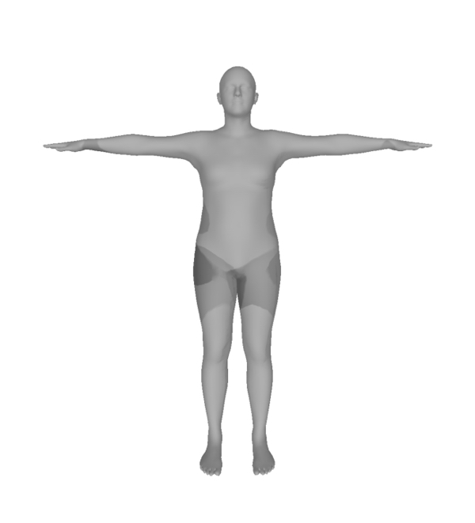
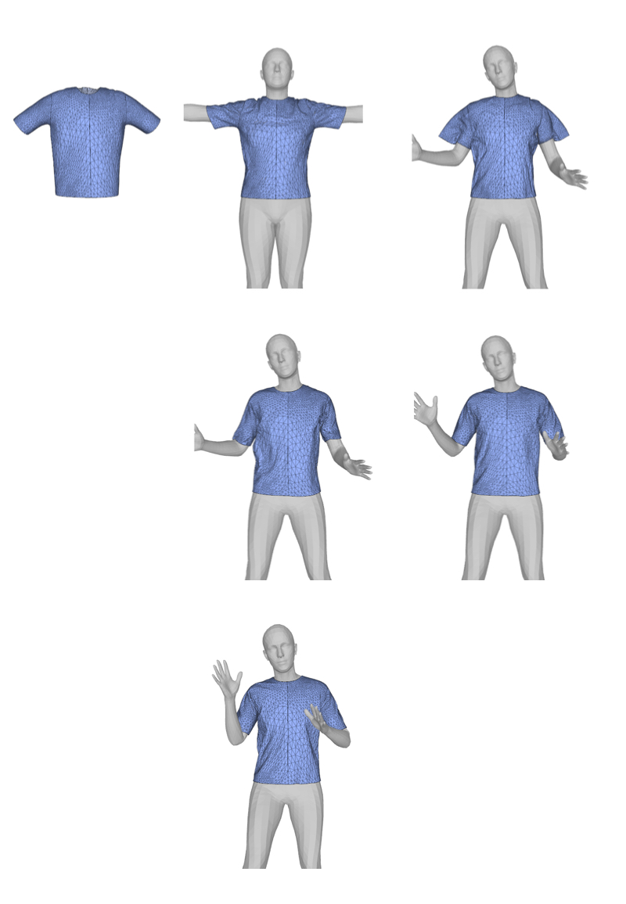

# Arcsim - SMPL
SMPL model obstacle support for [Arcsim](http://graphics.berkeley.edu/resources/ARCSim/), a simulation engine for animating sheets of deformable materials such as cloth, paper, plastic, and metal.

With the skinning blending feature of SMPL model integrated, **Arcsim - SMPL** is capable of mass producing a series of cloth deformations phsically realistic, which can be used as the dataset for DL model training.

This project is derived from [tomrunia/arcsim](https://github.com/tomrunia/arcsim), check out it's README file for more details.

## Installation

The provided Makefile can be used to compile the software on Linux.

You will need to have the following libraries installed:

* libboost-all-dev
* freeglut3-dev
* gfortran
* liblapacke-dev
* libpng-dev libpng++-dev
* libatlas-base-dev
* libopenblas-dev
* libjsoncpp-dev
* scons
* ctags
* sudo ln -s /usr/lib/x86_64-linux-gnu/libgfortran.so.N /usr/lib/libgfortran.so if `cannot find -lgfortran`

You should be able to get all of them through your distribution's package manager.

Build the dependencies inside the `dependencies/` foldor after installing the prerequisite libraries. Learn more detials from `dependencies/README_runia.md`

Finally build the program from root directory.

## Usage

General use cases can be found [here](https://github.com/McDo/arcsim-smpl/blob/main/README_tomrunia)

#### How to use SMPL model as an obstacle

1. Export SMPL models (in .obj format) into `meshes/` folder. Directories are required to be organized as

   - meshes/
     -  SMPL GROUPS/
        - SMPL GROUP 1/
            - body0001.obj
            - body0002.obj
            - ...
            - bodyXXXX.obj
        - SMPL GROUP 2 (if any) /
        - ...
        - base.obj

   The `base.obj` is the body model in rest pose. It should be positioned at the same level as other group folder(s), and parameterized as the same beta as other models.

   <br />

2. In the `conf` folder, define your smpl config file as

```javascript
{
    // must be true for SMPL obstacle
    "non_rigid": true,
    // transition time between adjacent frames
    "frame_time": 0.033, 
    // num of steps per frame to rest the cloth initially
    "init_frame_steps": 20, 
    // num of frames to wait until cloth rest, 20x3 steps to wait in this case
    "init_wait_frames": 3, 
    // num of steps for each frame, except for the initial frame(s)
    "frame_steps": 30,
    "cloths": [
        {
            "mesh": "meshes/PATH/TO/CLOTH/MESH/",
            "materials": [
                {
                    "data": "materials/gray-interlock.json",
                    "yield_curv": 200,
                    "damping": 0.001
                }
            ],
            "remeshing": {
                "refine_angle": 0.3,
                "refine_compression": 0.01,
                "refine_velocity": 0.5,
                "size": [
                    0.01,
                    0.2
                ],
                "aspect_min": 0.2
            }
        }
    ],
    "motions": [],
    "obstacles": [
        {
            "mesh": "meshes/SMPL GROUPS/SMPL GROUPS N/"
        }
    ],
    "gravity": [
        0,
        -9.8,
        0
    ],
    "disable": [
        "popfilter",
        "remeshing"
    ],
    "magic": {
        "repulsion_thickness": 0.005,
        "collision_stiffness": 1000000.0
    }
}
```

3. Head to the root directory and run

```bash
./run.sh [simulate | simulateoffline] [config name eg. sphere] [--output FOLDER NAME]
```

​	For example

```bash
./run-smpl.sh simulate smpl --output "smpl_outputs"
```

​	Mesh renderings will be exported to the `output/smpl_outputs` folder.

<br />